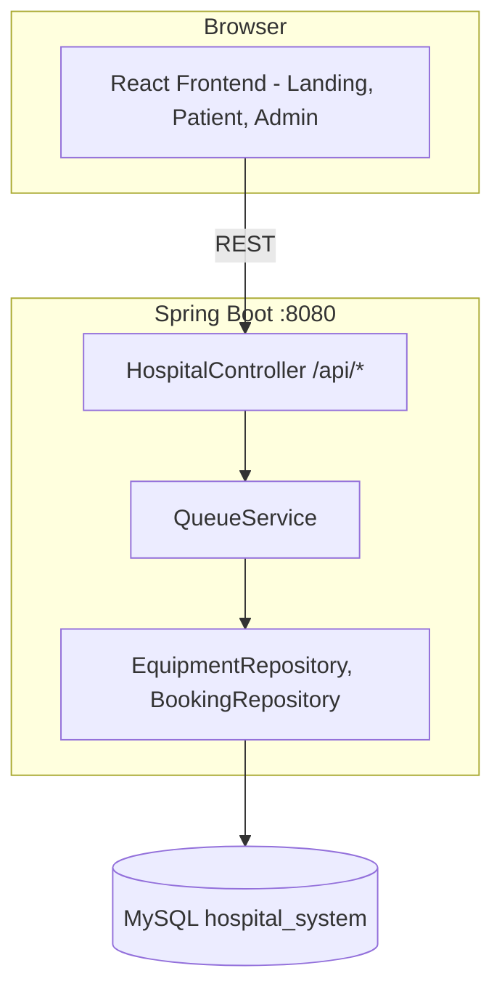
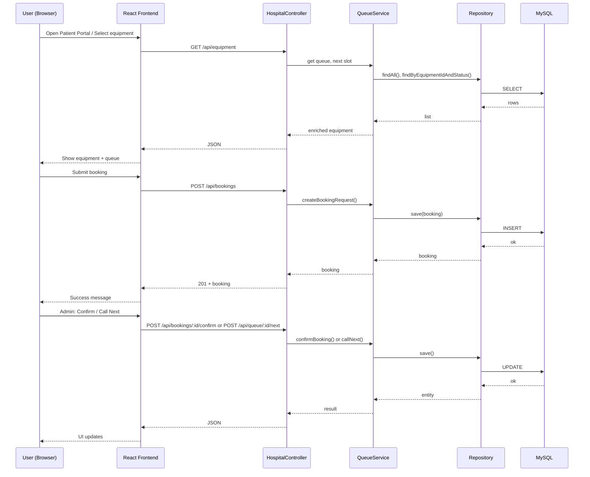

# EverVault | Project Presentation (PPT Outline)

Use this outline to build your PowerPoint. Add your own screenshots where indicated.

---

## Slide 1: Title
- **Title:** EverVault | Advanced Health Logistics
- **Subtitle:** Hospital Equipment Management System
- **By:** Evernorth Health Services
- **Screenshot:** [Add screenshot of Landing page – hero + “Go to Patient Portal” / “Admin Access”]

---

## Slide 2: Agenda
- Project overview
- High-level design
- Data flow
- Tech stack
- Key features & screenshots
- Demo / Testing
- Conclusion

---

## Slide 3: Project Overview
- **What:** Web app for managing hospital equipment (MRI, CT, Ventilator) and patient booking queues.
- **Who:** Designed for Evernorth Health Services.
- **Goals:**
  - Priority triage (Emergency > Urgent > Normal)
  - Live equipment status (Available / In Use / Maintenance)
  - Admin control to confirm bookings and call next patient
- **Screenshot:** [Add screenshot of Patient Portal – equipment cards + booking form]

---

## Slide 4: High-Level Design

**Copy the diagram from `diagrams/high-level-design.png` (generate from Mermaid below) or draw in PPT:**

```
┌─────────────────────────────────────────────────────────────────┐
│                        BROWSER (User)                             │
│  ┌──────────────────────────────────────────────────────────┐   │
│  │  React Frontend (Vite)                                     │   │
│  │  • LandingView  • PatientView  • AdminView  • NavBar      │   │
│  └────────────────────────────┬───────────────────────────────┘   │
└───────────────────────────────┼───────────────────────────────────┘
                                │ HTTP (REST API)
                                ▼
┌───────────────────────────────────────────────────────────────────┐
│  Spring Boot Backend (Port 8080)                                    │
│  ┌─────────────┐  ┌─────────────┐  ┌────────────────────────────┐ │
│  │ Controller  │  │ QueueService│  │ Repositories (JPA)          │ │
│  │ /api/*      │──│ (business   │──│ EquipmentRepository         │ │
│  │             │  │  logic)     │  │ BookingRepository           │ │
│  └─────────────┘  └──────┬─────┘  └──────────────┬─────────────┘ │
└──────────────────────────┼────────────────────────┼───────────────┘
                           │                        │
                           ▼                        ▼
                    ┌──────────────┐         ┌──────────────┐
                    │   MySQL      │         │   Static     │
                    │ hospital_    │         │   (built     │
                    │ system DB    │         │   React UI)  │
                    └──────────────┘         └──────────────┘
```

**Mermaid code (paste at https://mermaid.live to export as image):**



---

## Slide 5: Data Flow Diagram

**Screenshot:** [Use diagram from `diagrams/data-flow.png` or Mermaid below]

**Mermaid code (paste at https://mermaid.live to export as image):**



---

## Slide 6: Tech Stack
| Layer      | Technology              |
|-----------|--------------------------|
| Frontend  | React, Vite, CSS        |
| Backend   | Java 17, Spring Boot 3.2|
| API       | REST (JSON)             |
| Database  | MySQL, JPA / Hibernate  |
| Build     | Maven, npm              |

- **Run:** Single command – `mvn spring-boot:run` (frontend built into backend static).

---

## Slide 7: Key Features – Screenshots
- **Landing:** [Screenshot – hero + two buttons]
- **Patient Portal:** [Screenshot – equipment cards + booking form]
- **Admin Control:** [Screenshot – machine cards + Triage Queue + Live Operations + “Call Next Patient”]
- **Priority Triage:** Emergency > Urgent > Normal; equipment status (Available / In Use / Maintenance).

---

## Slide 8: Testing
- **Unit tests:** QueueService (priority sort, mark as served, next slot).
- **Controller tests:** GET /api/equipment, POST /api/bookings.
- **Run:** `mvn test`
- **Screenshot:** [Terminal showing “Tests run: 5, Failures: 0” or similar]

---

## Slide 9: Conclusion
- EverVault provides a simple, end-to-end flow: patient booking → admin triage → queue and equipment status.
- Single deploy: Spring Boot on port 8080 (React built into static).
- Database: MySQL; optional unit and controller tests for reliability.

---

## How to Get Diagram Images for PPT

1. **Mermaid diagrams:** Go to https://mermaid.live and paste the Mermaid code from Slide 4 or 5. Export as PNG and insert into PowerPoint.
2. **Screenshots:** Run the app (`mvn spring-boot:run` in `hospital-system/backend`), open http://localhost:8080, and capture:
   - Landing page
   - Patient Portal (with equipment and form)
   - Admin Control (with machines and queues)
